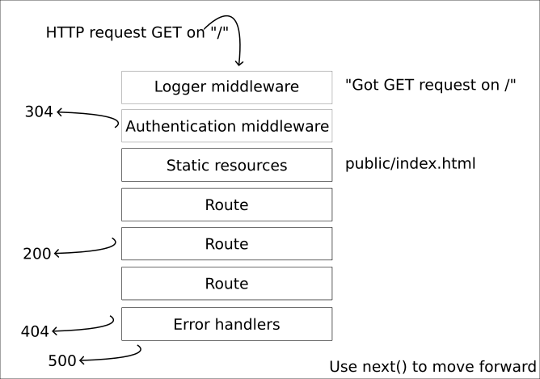

Express.js web application framework
========================

Presenting the Express web application framwork, its parts, how it works and how to get going with it. 

You can browse [the HTML slides used in the presentation](https://mikael-roos.gitlab.io/node/lecture/L04-express-framework/slide.html) (press f/esc to enter/exit full screen mode and navigate using the arrows).

Recorded presentation, 29 minutes long (English).

Learn more
------------------------

To get going with your own example code, work through the ["Get Started" guide on the Express website](https://expressjs.com/en/starter/installing.html).

There is also an small exercise in [`src/express/hello`](../../../src/express/hello/) that includes the code samples used in the slides.

Resources
------------------------

Resources that are used, or are relevant, for the areas that the lecture covers.

* [Express](https://expressjs.com/)
* [Wikipedia on Express.js](https://en.wikipedia.org/wiki/Express.js)
* [OpenJS Foundation projects](https://openjsf.org/projects/)
* [EJS](https://ejs.co/)
* [Nodemon](https://www.npmjs.com/package/nodemon)
* [Logger morgan](https://www.npmjs.com/package/morgan)
