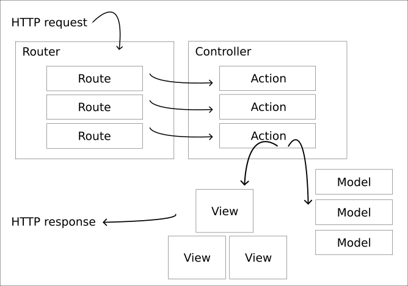

Model View Controller (MVC) with Express
========================

Presenting the Model view Controller (MVC) architectural design pattern and how it can be implemented with Express web framework.

You can browse [the HTML slides used in the presentation](https://mikael-roos.gitlab.io/node/lecture/L05-model-view-controller/slide.html) (press f/esc to enter/exit full screen mode and navigate using the arrows).

Recorded presentation, 34 minutes long (English).

Learn more
------------------------

The code used in the slides are available in the exercise [`src/express/mvc`](../../../src/express/mvc/).

Resources
------------------------

Resources that are used, or are relevant, for the areas that the lecture covers.

* [Wikipedia Model–view–controller](https://en.wikipedia.org/wiki/Model%E2%80%93view%E2%80%93controller)
* [Express](https://expressjs.com/)
