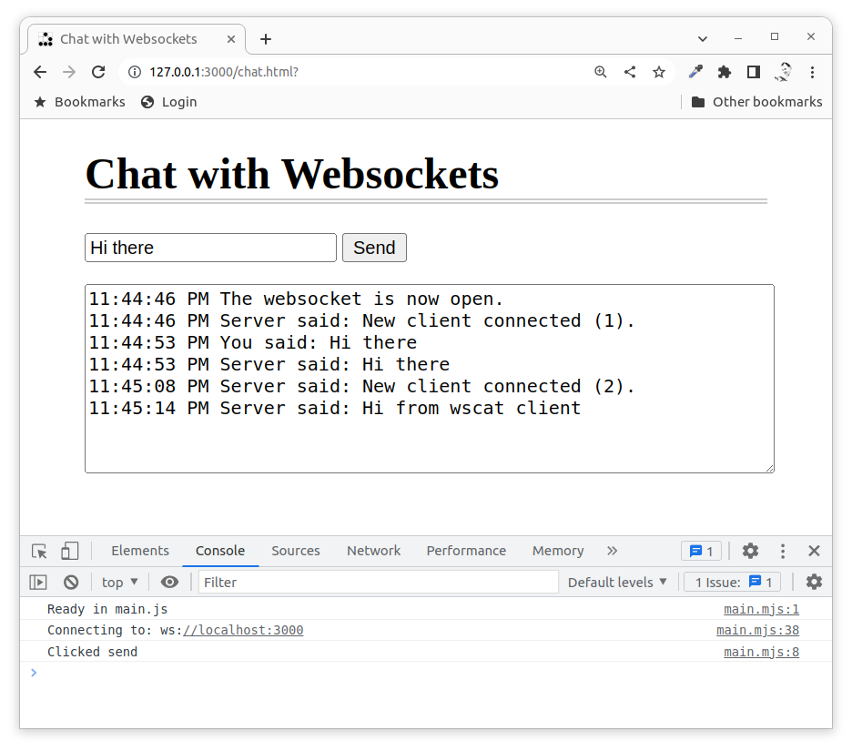

Realtime web
========================

Presenting how real-time aspects can be implemented in the web area, discussing real-time aspects, examples on application areas and web technologies and APIs usable to complement a near real-time feeling using the web browser as the interface.

You can browse [the HTML slides used in the presentation](https://mikael-roos.gitlab.io/node/lecture/L11-realtime/slide.html) (press f/esc to enter/exit full screen mode and navigate using the arrows).

Recorded presentation, 22 minutes long (English).

Learn more
------------------------

To learn more you can work with the exercise below.

* [`src/express/websocket`](../../../src/express/websocket/)

<!-- * [`src/express/socketio`](../../../src/express/socketio/) -->

Work through the exercise to get a live and running example on websockets together with an understanding on how to implement client side, server side and how to troubleshoot.

The communication framework SocketIO can also be used to implement a communication layer on top of websockets, check their [Get started with SocketIO](https://socket.io/get-started/chat), if you prefer SocketIO over Websocket.

Resources
------------------------

Resources that are used, or are relevant, for the areas that the lecture covers.

* [MDN Websockets](https://developer.mozilla.org/en-US/docs/Web/API/WebSocket)
* [npm ws: a Node.js WebSocket library](https://www.npmjs.com/package/ws)
* [npm wscat](https://www.npmjs.com/package/wscat)
* [Socket.IO website](https://socket.io/)
* [npm socket.io](https://www.npmjs.com/package/socket.io)
 