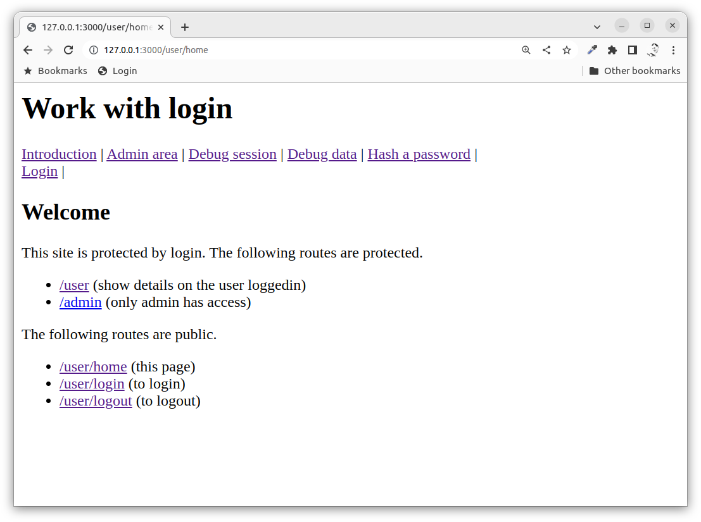
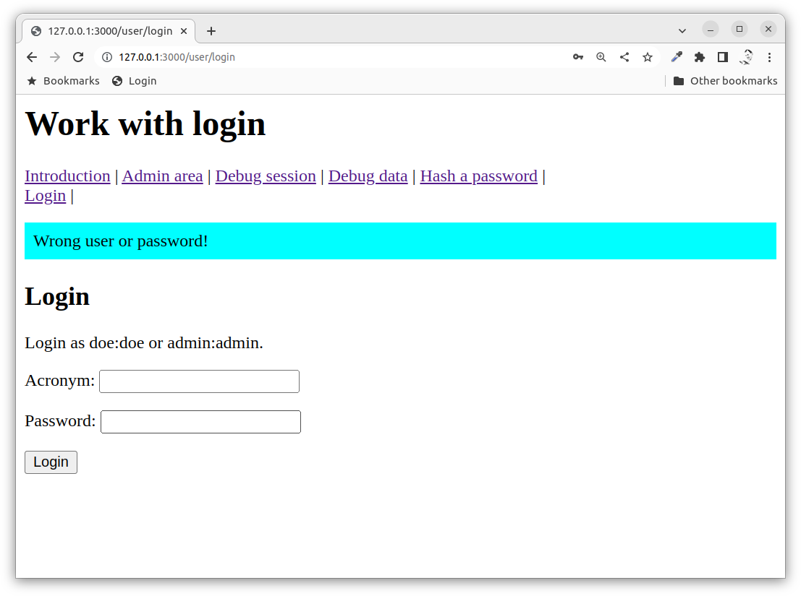
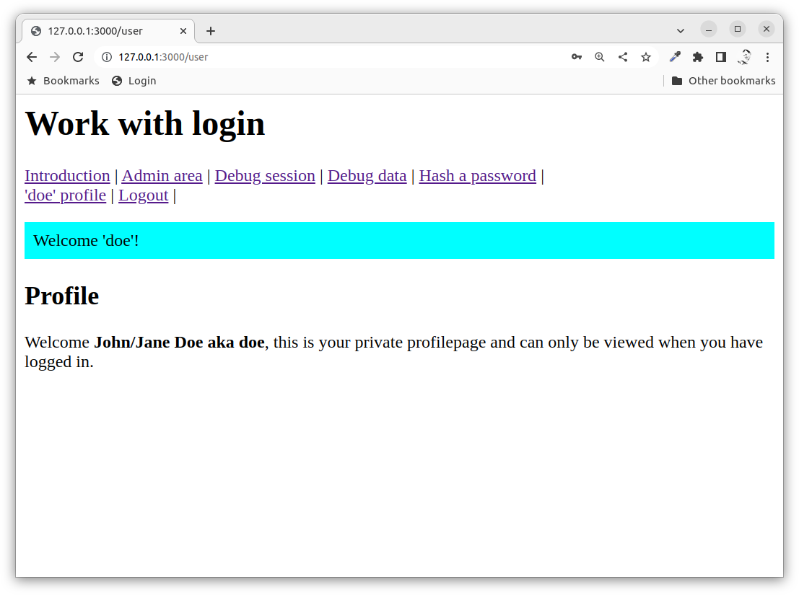
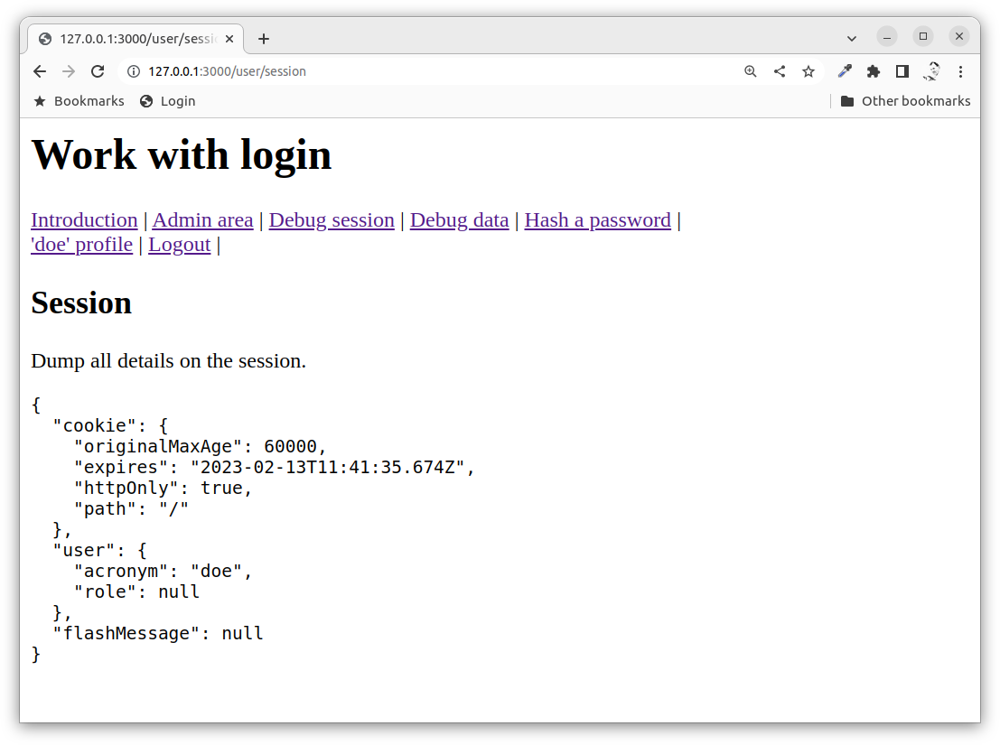
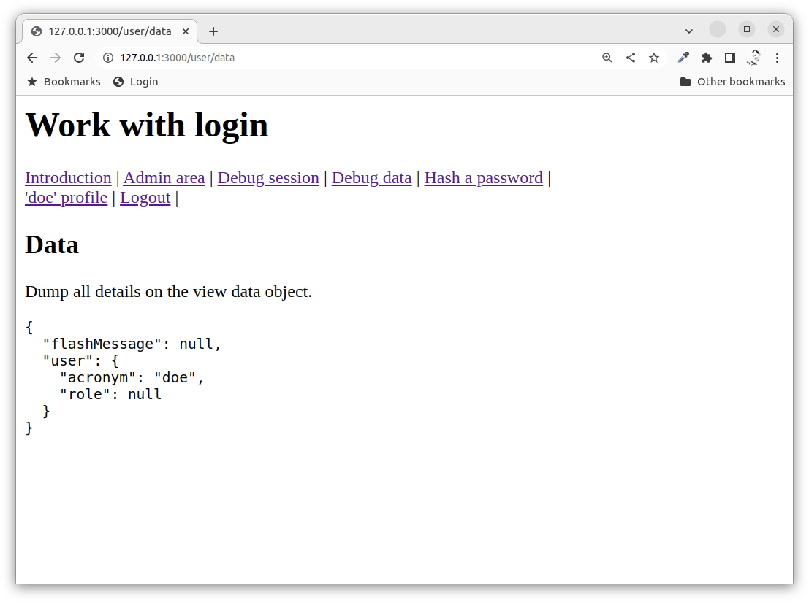
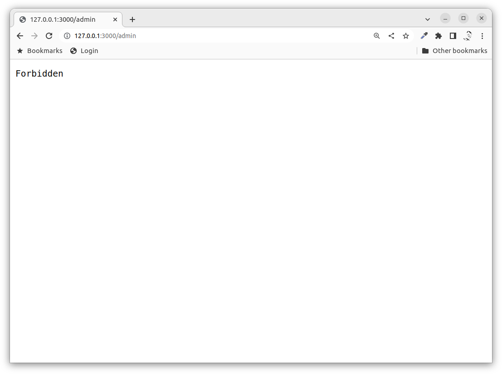
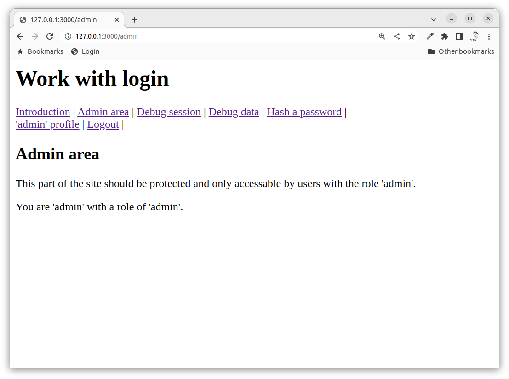

Express with authentication and login
==============================

This example shows how to use Express to enable login using authentication and the session. The user and the passwords are encrypted using bcrypt. The example does not use a data source to store the user and password.

[[_TOC_]]


<!--
TODO

* Flash message can not survive double redirect, for example double POST redirect
* Add public routes for user profile

-->

Video
-----------------------------

This is a recorded presentation, 18 minutes long (English), when Mikael goes through the content of this article.

[](https://www.youtube.com/watch?v=wM1RPbxamC4)


Start the server
-----------------------------

The server is based on the same MVC structure for the code as the [session](./../session/) example.

Install the dependencies:

```
npm install
```

Start the server:

```
npm start
```

Open a web browser and connect to it using: `http://127.0.0.1:3000/`.

Use the crud example through this start route:

* `/user/home`



Check the output in the console and the source code to understand the application flow of each route.


Bcrypt to hash the password
-----------------------------

The user passwords are stored in the controller file to make an easy example. The passwords are encryhashed pted using the [npm bcrypt package](https://www.npmjs.com/package/bcrypt).

It looks like this when hashing a password.

```javascript
import bcrypt from 'bcrypt'

const plainPassword = req.body.password
const saltRounds = 10;
const hashedPassword = await bcrypt.hash(plainPassword, saltRounds)
```

The hashed password is then supposed to be stored in the database together with the user details.

When someone tries to login then the entered password shoould be matched agains the hash, something like this.

```javascript
const success = await bcrypt.compare(enteredPassword, hashedPassword);
```

The example has a route `/user/hash` where you can try to hash a password.


Login and profile
-----------------------------

You can now try to login as the user 'doe' with the password 'doe' or as the user 'admin' with the user 'admin'.

The following routes are involved in this.

```javascript
router.get('/login', controller.login)
router.post('/login', controller.loginProcess)
router.get('/', controller.profile)
```

It looks like this when you try to login.


If you enter a non exiting user or a wrong password, then you will be redirected back to the login form again and a flash message is shown.



It is called a flash message since it is only shown once and the message will go away if you reload the page.

This is how it looks like when you do a successful login, you are redirected to the users personal profile.



The view `header.ejs` has a section that cehcks if the user is logged in and changes the navbar accordingly.

```html
<% if (locals.user.acronym) { %>
    <a href="/user">'<%= user.acronym %>' profile</a> |
    <a href="/user/logout">Logout</a> |
<% } else { %>
    <a href="/user/login">Login</a> |
<% } %>
```


Middleware for the session
-----------------------------

The session is implemented as a middleware and uses sessions cookie to enable the session storage for each user on the serverside.

This is how you can setup the session in your server.

```javascript
import session from 'express-session'

// Enable the session
app.use(session({
  cookie: {
    maxAge: 60000
  },
  resave: false,
  saveUninitialized: true,
  secret: 'keyboard cat'
}))
```

View [details in the docs of `express-session`](https://www.npmjs.com/package/express-session).

The session data is now available as `req.session` and can be used to store details on the user session.

There is a debug route `/user/session` that shows the current content of the session. The image shows what details are stored on the current user in the session.



When the user is authenticated and logged in, then the user acronym and role is stored in the session. It might be a bad practice to save the role in the session (it could be retrieved on each new route), but it was convienient way to implement this example.


Middleware and view for the flash message
-----------------------------

The feature with the flash message is to enable a message to be displayed in the next page. This is useful when processing a submitted form and you want to display to the user if the processing went fine.

The flash message can be stored in the session like this.

```javascript
req.session.flashMessage = `Welcome '${username}'!`
```

Then, on next request, the flash message can be retrieved from the session and displayed in a view.

The example code uses a middleware to extract and prepare the flash message into the data object that is sent to the views. This can off course be implemented in various other ways.

```javascript
// Enable use of flash messages and prepare the data object
app.use((req, res, next) => {
  res.data = {}
  res.data.flashMessage = null
  if (req.session && req.session.flashMessage) {
    res.data.flashMessage = req.session.flashMessage
    req.session.flashMessage = null
  }
  next()
})
```

The view `flash.ejs` is always imported from the view `header.ejs`.

```html
<%- include('flash') -%>
```

The `flash.ejs` view looks like this.

```html
<% if (flashMessage) { %>
    <p style="background-color:aqua; padding: 0.5em"><%- flashMessage %></p>
<% } %>
```


Middleware to check if user is authenticated
-----------------------------

There is also a middleware that checks if the user is logged in and prepares the view data object with details on the user. This is to simplify the others routes so this data is always available for all routes and all views.

```javascript
// Check if user is logged in and prepare the data object
app.use((req, res, next) => {
  res.data.user = {
    acronym: null,
    role: null
  }
  if (req.session && req.session.user) {
    res.data.user.acronym = req.session.user.acronym ?? null
  }
  if (req.session && req.session.user) {
    res.data.user.role = req.session.user.role ?? null
  }
  next()
})
```

The idea is to prepare the `res.data` with details about the user (and about the flash message) to make simpler code in each controller action.

The object `res.data` is then used as a template for each route and passed further to each view. For example like this.

```javascript
  res.render('login_form', res.data)
```


Debug view data
-----------------------------

It might help to understand how the `res.data` is populated with data from the middleware by checking the debug route `user/data` that shows the content of the `res.data` as populated by the middlewares.




Logout
-----------------------------

The route for logout is not protected and it only unsets the user data in the session which makes the user to apper as logged out.

It is the content of the session that decides if a user is logged in or not.

This is how the user is actually logged out by unsetting the user part of the session.

```javascript
/**
 * Logout the user.
 *
 * @param {object} req Express request object.
 * @param {object} res Express response object.
 */
controller.logout = (req, res) => {
  req.session.user = null
  res.redirect('/user/home')
}
```

One could argue that the logout route should only be accessible if you have logged in. That is a reasonable improvement.


Protected admin area
-----------------------------

There is a separate admin area which can only be accessed by users who has a role of `admin`. Login as the user 'doe' and verify that you can not reach the admin area.



Then login as the admin user and check that you can login to the protected admin area in `/admin`.



The route, and the protection of it, is setup like this.

```javascript
router.get('/', controller.isAdmin, controller.home)
```

You can see that a middleware `controller.isAdmin` is prepended before the actual route action which is `controller.home`.

You can see the implementation of both methods here. See if you can follow the flow.

```javascript
/**
 * Check if user is admin.
 *
 * @param {object} req Express request object.
 * @param {object} res Express response object.
 */
controller.isAdmin = (req, res, next) => {
  if (res.data.user.role === 'admin') {
    next()
  } else {
    res.send(403)
  }
}
```

```javascript
/**
 * Admin home page where to start.
 *
 * @param {object} req Express request object.
 * @param {object} res Express response object.
 */
controller.home = (req, res) => {
  res.render('admin/home', res.data)
}
```

This is another way of using middleware, here we use it to protect routes.

A thoughful usage of middlewares might enhance your overall code structure.


Improvements to code structure
-----------------------------

This example is implemented without the use of model classes. To enhace it you might want to move the code on the user and authentication to a model class and the user and password should be placed in a database.

You might also clean up the `src/express.mjs` and move some middleware implementation code to its own module to enhance readability.


Summary
-----------------------------

This example showed how to work with a user with atuhentication and how to login to a website using sessions and flash messages.
