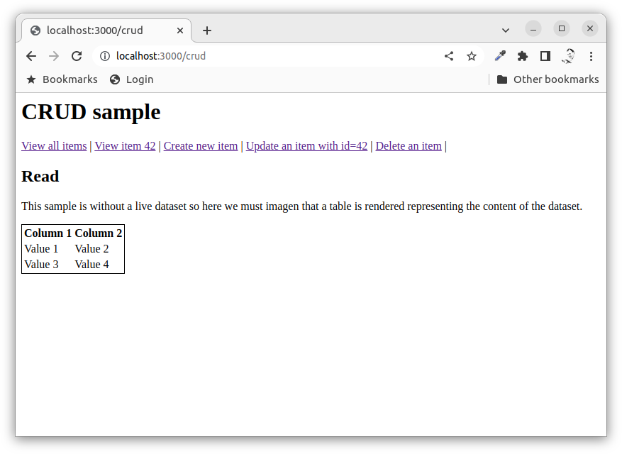
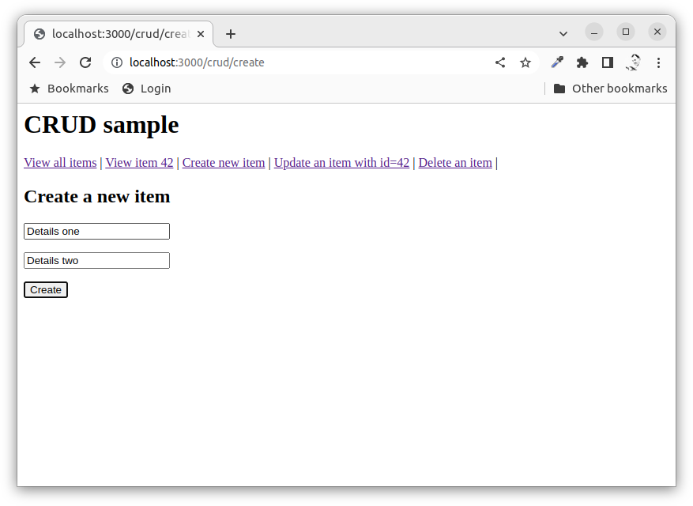
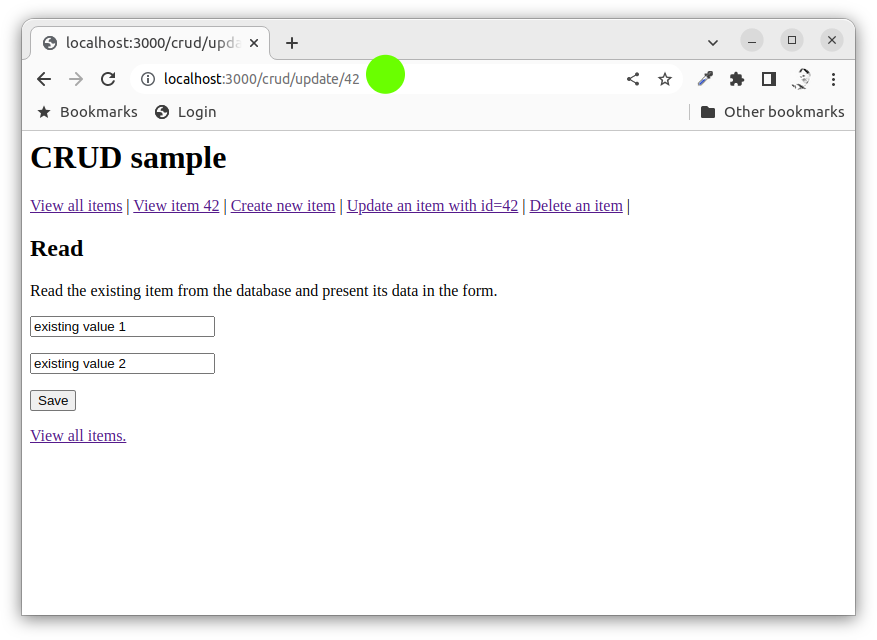
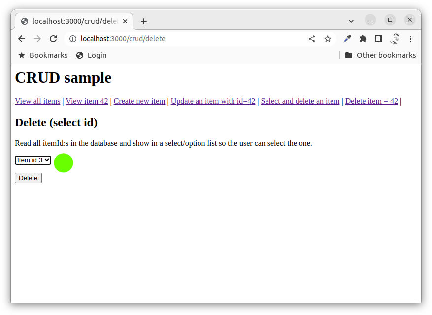
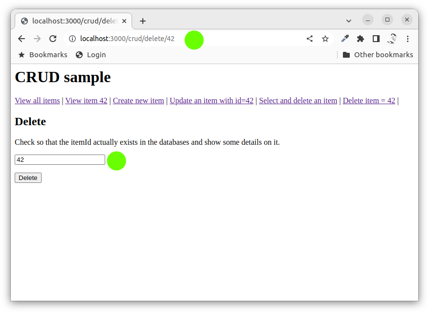

Express with Create, Read, Update, Delete (CRUD)
==============================

This example shows how to use Express to achieve a CRUD functionality where routes are structured in a controller. The example does not use any model or actual implementation of the data source and storage part.

[[_TOC_]]

<!--
TODO

* Add CSRF middleware, possible or use in a separate sessiion on the basic protection mechanisms?
-->


Video
-----------------------------

This is a recorded presentation, 12 minutes long (English), when Mikael goes through the content of this article.

[](https://www.youtube.com/watch?v=NKz5glWqaTc)


Start the server
-----------------------------

The server is based on the same MVC structure for the code as the [mvc](./../mvc/) and [mongoose](./../mongoose/) examples.

Install the dependencies:

```
npm install
```

Start the server:

```
npm start
```

Open a web browser and connect to it using: `http://127.0.0.1:3000/`.

Use the crud example through this start route:

* `/crud/`

Check the output in the console and the source code to understand the application flow.


Middleware to parse the body
-----------------------------

In the example the express server is using two middlewares to enable parsing the body. The example actually only uses the first parser but the JSON parser is added as an example.

```javascript
// Parse URL-encoded bodies (as sent by HTML forms)
app.use(express.urlencoded({ extended: true }))

// Parse JSON bodies (as sent by API clients)
app.use(express.json())
```

The posted body will be empty if you forget to add these middlewares.


Read
-----------------------------

The following routes are related to reading from the database.

```javascript
// R read from database, list all items
router.get('/', controller.list)
router.get('/id/:itemId', controller.show)
```

The first page shows a listing of all imaginary rows in the data source.



The second link shows a listing where only one item is read from the datasource and displayed.


These two pages are useful to redirect to, when we want to show all/one row.


Create
-----------------------------

The following routes are related to creating a new item in the database.

```javascript
// C create new item into the database
router.get('/create', controller.createForm)
router.post('/create', controller.createSave)
```

The first page creates a HTML form where we can add details on the new item and submit it.



The form posts to the POST route which saves the data to the data source.

When it is done it redirects to a resultpage which could be "read all" or "read one" with the newly created id.


Update
-----------------------------

The following routes are related to updating an item in the database.

```javascript
// U update an existing item in the database
router.get('/update/:itemId', controller.updateForm)
router.post('/update', controller.updateSave)
```

The first page creates a form and insert the current details on the item. It is now possible to change details and submit them. The id of the item is stored as a hidden field in the form.



The POST route saves the updated details to the data source.

When it is done it can redirect back to the first route so the user sees what was updated and can continue editing it.


Delete
-----------------------------

The following routes are related to updating an item in the database.

```javascript
// D delete item from database
router.get('/delete', controller.deleteFormSelect)
router.get('/delete/:itemId', controller.deleteForm)
router.post('/delete', controller.deleteSave)
```

The first route creates a form and displays all items so the user can select which item to delete.



The other alternative route gets a id as a route parameter and displays details on this item and it can then be deleted.



Either form post to the POST route which executes the delete in the data source.

When it is done it can redirect to some result page, for example "view all".


Summary
-----------------------------

This example showed how to organise the routes, controller actions and how to write the views to implement a Create, Read, Update, Delete (CRUD) application with as a web application.
