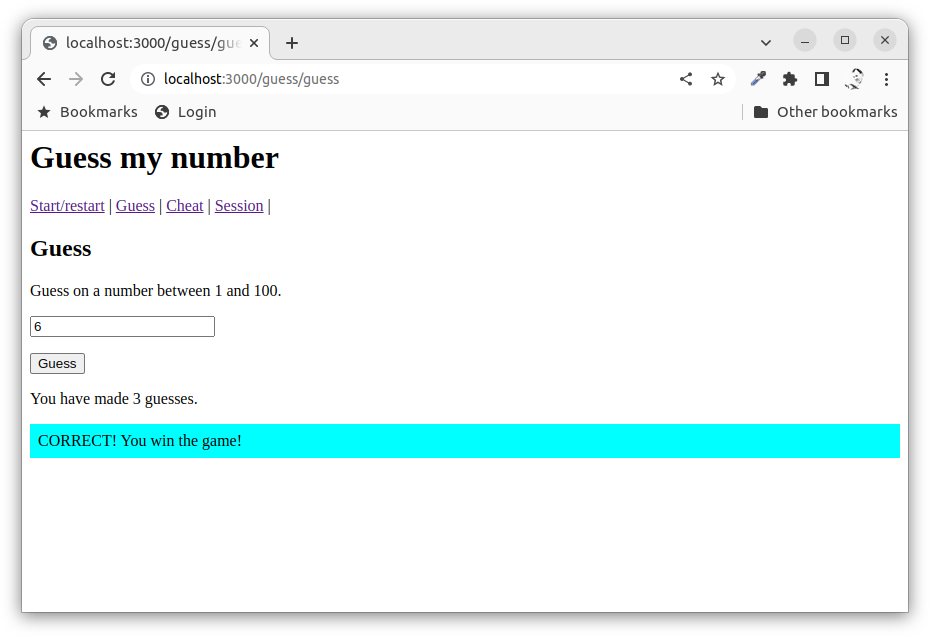
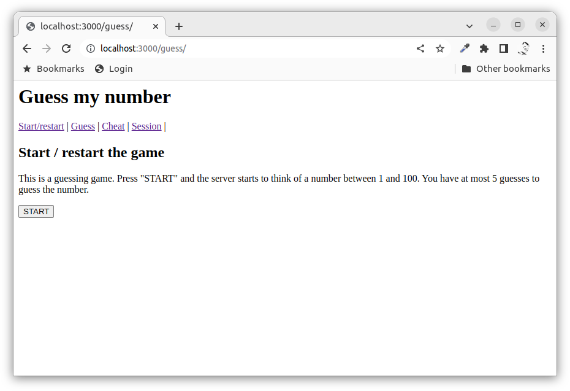
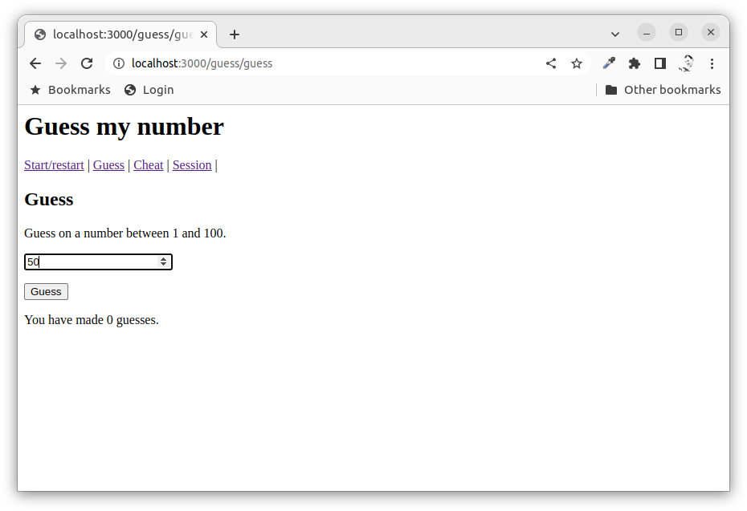
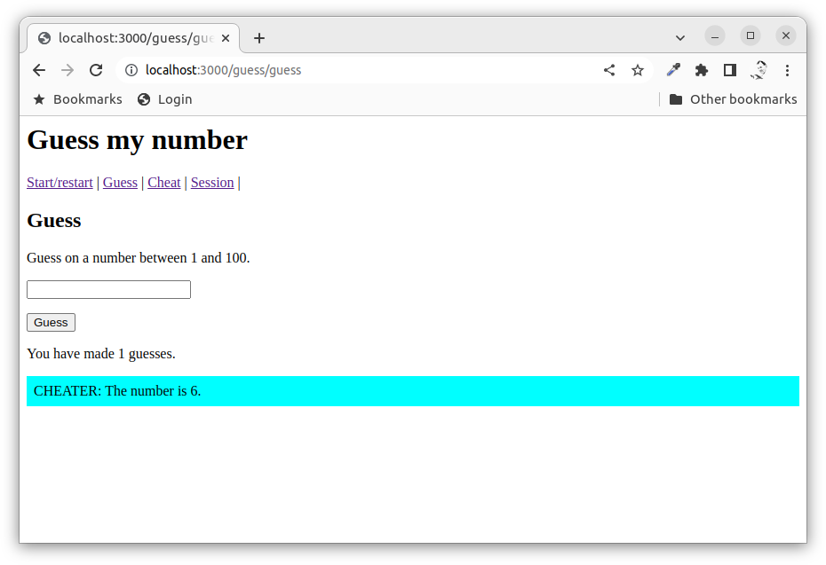
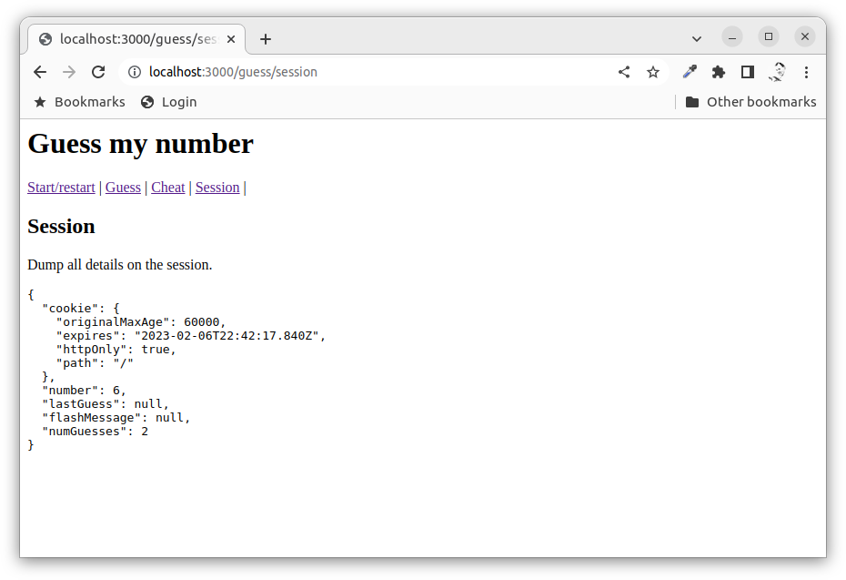

Express with session and flash messages
==============================

This example shows how to use Express with sessions. The example shows how one can implement a small guessing game using the session and how to work with flash messages to send notices to the next page rendering.

[[_TOC_]]




Video
-----------------------------

This is a recorded presentation, 12 minutes long (English), when Mikael goes through the content of this article.

[](https://www.youtube.com/watch?v=tELvRoiho9I)


Start the server
-----------------------------

The server is based on the same MVC structure for the code as the [mvc](./../mvc/), [mongoose](./../mongoose/) and [crud](./../crud/) examples.

Install the dependencies:

```
npm install
```

Start the server:

```
npm start
```

Open a web browser and connect to it using: `http://127.0.0.1:3000/`.

Use the crud example through this start route:

* `/guess/`

Check the output in the console and the source code to understand the application flow.


Middleware to deal with the session
-----------------------------

To enable the session we use a [middleware express-session](http://expressjs.com/en/resources/middleware/session.html). This is already installed as part of the `package.json` and it is enabled in the `src/express.mjs` server like this.

```javascript
import session from 'express-session'

app.use(session({
  secret: 'keyboard cat',
  cookie: {
    maxAge: 60000
  }
}))
```

The session will be undefined if you forget to add the middleware.


The game
-----------------------------

To show off how the session works, a small guessing game is implemented where the user should try to guess on a number that the server thinks on, between 1 and 100.

The game is implemented through these routes.

```javascript
router.get('/', controller.home)
router.post('/init', controller.init)

router.get('/guess', controller.guess)
router.post('/guess', controller.guessCheck)

router.get('/cheat', controller.cheat)
router.get('/session', controller.session)
```

The actual session data is available as `req.session` and you can save your own data to it, for example using `req.session.data = 'some data'`.

The game looks like this when you play it. Check out the controller and the views for the actual implementation of the routes and the game.


### Start the game

First you need to start the game. This will also initiate the session and randomize a number and store it in the session. The number of guesses are now set to 0.




### Guess a number

You can then guess on a number.



The route will check if the guess is correct or not and it will save a message in the session that is printed on the result page. This is known as a "flash message" and it is a way to send a message to the next route.

If you guess the correct number you win the game.


### Cheat

You can cheat to see what the number is.




### Session

You can debug the session and see what it contains.




Implementation of the guess game
-----------------------------

The example has implemented the guessing game code within the controller. This should really be implemented into a model game class to follow the rule of "thin controllers adnd thick models".

Perhaps you would like to rewrite the game engine and move the code to a model class/module?

You could then also try to implement so the game enforces max 5 guesses and that you can not continue to make any guesses when you have won the game.

Perhaps you also should consider what happen when the user enters something that is not a number? Do you need to check that on the server side?


Summary
-----------------------------

This example showed how to work with the session and flash messages.
