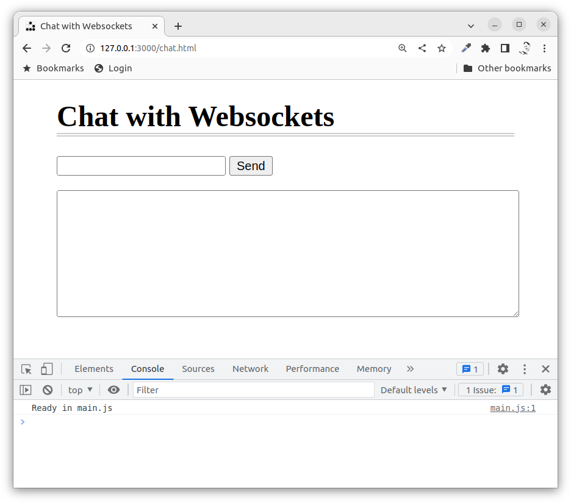
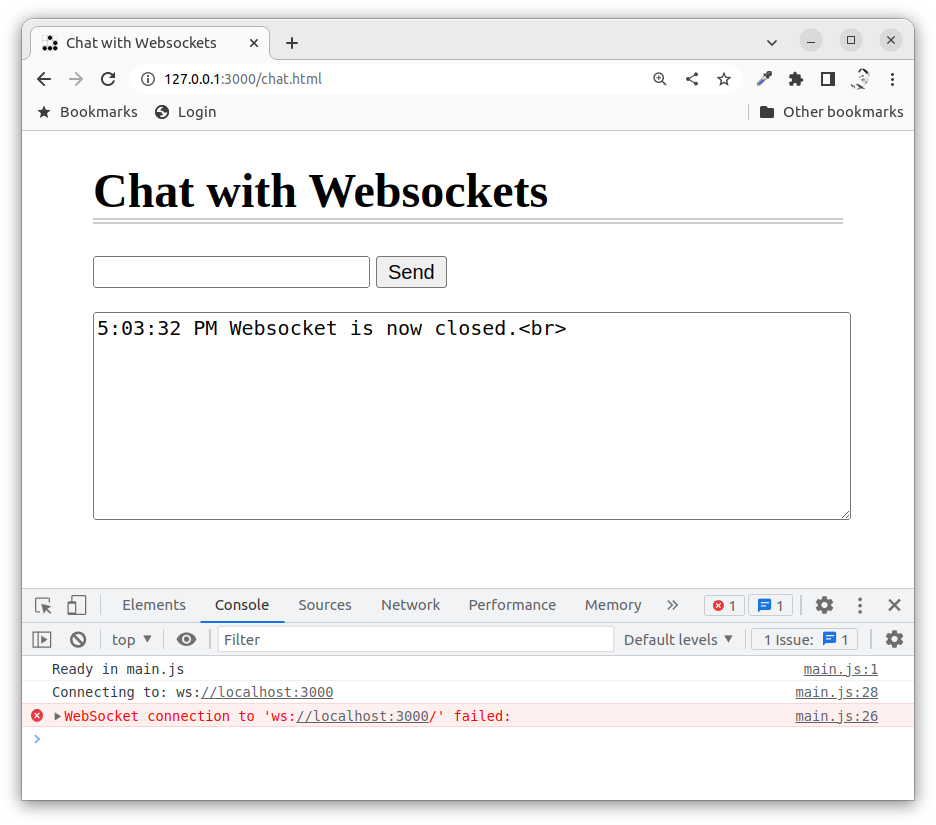
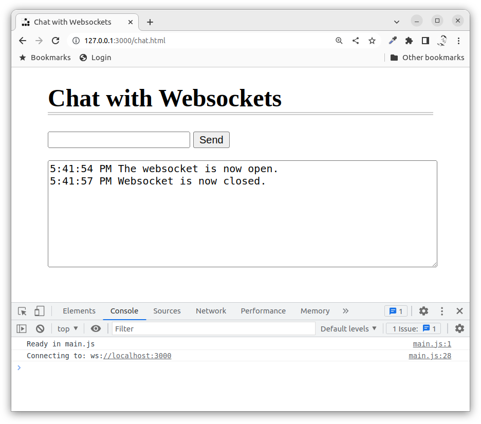
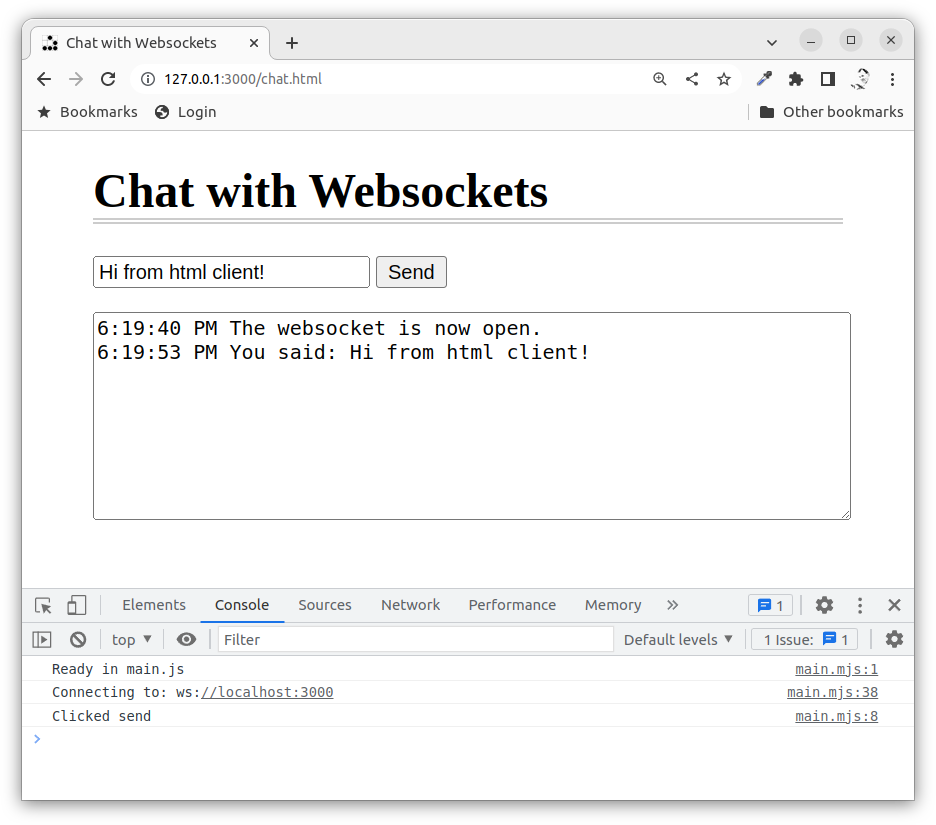
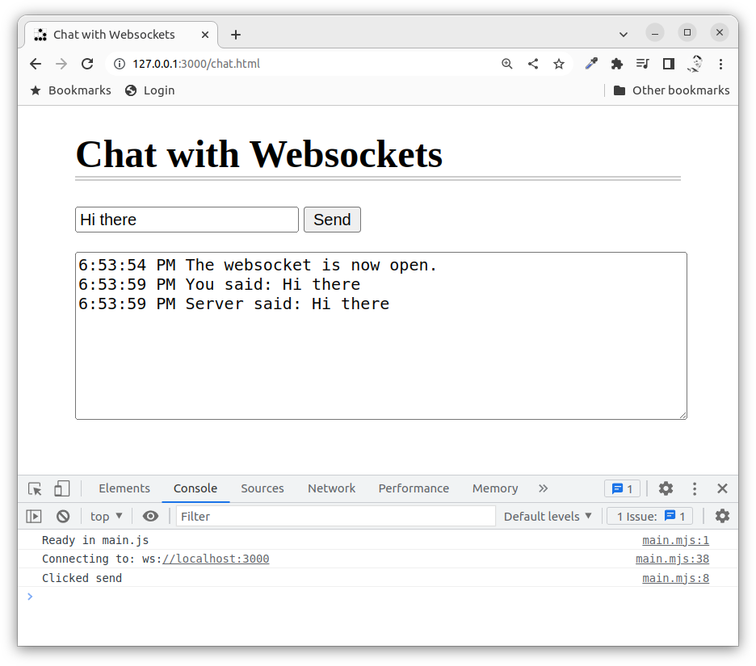

SocketIO with Express
==============================

**UNDER DEVELOPMENT, NOT YET RELEASED**

This example shows how to use Express to build a websocket server using [the communication framework SocketIO](https://socket.io/). It will show you how to build up and test the client and the server, step by step.

[[_TOC_]]


<!--
TODO

* 

-->

<!--
Video
-----------------------------

This is a recorded presentation, 18 minutes long (English), when Mikael goes through the content of this article.

[](https://www.youtube.com/watch?v=wM1RPbxamC4)
-->


Precondition
-----------------------------

This example expects that you have worked through the example on [Websockets with Express](../websocket), or that you have similair knowledge on websockets with Express, websocket client, wscat, echo server and broadcast server.

You can also follow the ["Get started" example on the socket.io website](https://socket.io/get-started/chat) to get additional details and explanaitions.


Start the server
-----------------------------

Lets see how we can adapt the existing websocket implemementation and replace it with a implementation using SocketIO.

The [npm package socket.io](https://www.npmjs.com/package/socket.io) is already included in the `package.json` file.

```
npm install
```

Start the server:

```
npm start
```

Open a web browser and connect to it using: `http://127.0.0.1:3000/`.


HTML GUI for the client
-----------------------------

We can add the same client we used for the websocket implementation.


Lets add a static HTML page as the GUI for the websocket and add it as `public/chat.html`.

Now try to open it in your web browser through `http://127.0.0.1:3000/chat.html`. It looks something like this.



The HTML for the client can look like this.

```html
<!doctype html>
<head>
    <meta charset="utf8">
    <link rel="stylesheet" href="css/style.css">
    <title>Chat with Websockets</title>
</head>

<body>
    <h1>Chat with Websockets</h1>
    <form>
        <input id="message" type="text">
        <input id="send" type="button" value="Send">
        <p>
            <textarea id="output" class="output"></textarea>
        </p>
    </form>
</body>

<script type="module" src="js/main.mjs"></script>
</html>
```

The stylesheet is not relevant for the example and the `js/main.mjs` could be prepared with the following code to start with.

```javascript
console.log("Ready in main.js")

const message = document.getElementById('message')
const send = document.getElementById('send')
const output = document.getElementById('output')

send.addEventListener('click', (ev) => {
  console.log("Clicked send")
})

/**
 * Output data to the client gui.
 */
function outputLog (data) {
  const now = new Date()
  const timestamp = now.toLocaleTimeString()

  output.textContent += `${timestamp} ${data}\n`
  output.scrollTop = output.scrollHeight
}
```

Lets continue to add the websocket client code.


Websocket client
-----------------------------

It is assumed that you already know how to implement the client side of a websocket so you most likely understand the following code in the client.

```javascript
/**
 * Structure for the websocket client
 */
const url = 'ws://localhost:3000'
const websocket = new WebSocket(url)

console.log(`Connecting to: ${url}`)

websocket.onopen = () => {
  outputLog('The websocket is now open.')
}

websocket.onmessage = (event) => {
  outputLog('Server said: ' + event.data)
}

websocket.onclose = () => {
  outputLog('Websocket is now closed.')
}
```

Note that the url is hardcoded in the example code and it uses the same url as the server is running on.

We can reload the client to see what happens.



It fails, that is reasonable givven that there is no server responding.

Lets proceed with the server part.


Websocket server
-----------------------------

To implement the Websocket server we use a [npm module `ws`](https://www.npmjs.com/package/ws) which is an server-side implementation of the Websocket API.

The first part is to make an instance of the websocket server.

```javascript
import { WebSocketServer } from 'ws'

const app = express()
const wsServer = new WebSocketServer({
  noServer: true
})
```

Then we need to attach it to the express server and tha plan is to reuse the existing httpServer that express is using. This code enables that, including dealing with the request on upgrading the protocol.

```javascript
export default (port = 3000) => {
  const server = app.listen(port, () => {
    console.log(`Listening at port ${port}`)
  })

  // Enable upgrade requests on http to ws
  server.on('upgrade', (request, socket, head) => {
    wsServer.handleUpgrade(request, socket, head, socket => {
      wsServer.emit('connection', socket, request)
    })
  })
}
```

The first part of the code is the way we usually start the Express server, below that we reuses the server created and inmplement a callback for the upgrade event. It will be the client that initiates the request to upgrade from http to websockets and the code above implements that request using the websocket server object.

We can now start the server and reload the client to see that the connection is established.

If you then close the server, you will see that the client drops the connection.

It can look like this in the client.



Lets also deal with the messages.


Make the server receive messages
-----------------------------

To make the server receive messages we implement a callback on the `message` event, for each new connection made.

```javascript
wsServer.on('connection', (ws) => {
  ws.on('message', (data) => {
    console.log(`ws got: ${data}`)
  })
})
```

We can test if it works by running the external command `wscat` to connect to the server and send a message.

```
$ npx wscat --connect ws://localhost:3000
Connected (press CTRL+C to quit)
> hi
```

You should now see the output received in the server, something like this.

```
Listening at port 3000
ws got: hi
```

You can read more on the [npm package wscat](https://www.npmjs.com/package/wscat) to see how it can be used to test and debug websocket applications.


Make the client send messages
-----------------------------

To enable the client to send messages we implement the callback for when the "Send" button is clicked.

```javascript
send.addEventListener('click', (ev) => {
  console.log('Clicked send')
  const messageText = message.value

  if (!websocket || websocket.readyState === 3) {
    outputLog('The websocket is not connected to a server.')
  } else {
    websocket.send(messageText)
    outputLog('You said: ' + messageText)
  }
})
```

If you reload to try it out it can look like this.



You should also se something like this in the teminal where the server runs.

```
ws got: Hi from html client!
```


Echo server
-----------------------------

We can update the server to send back the same message it got from the client, thus making it an echo server. It is basically just to add the method `ws.send(data)`.

```javascript
wsServer.on('connection', (ws) => {
  ws.on('message', (data) => {
    console.log(`ws got: ${data}`)
    ws.send(data)
  })
})
```

On the client side we need to update the code where we receive a message.

```javascript
websocket.onmessage = async (event) => {
  const text = await new Response(event.data).text()
  outputLog(`Server said: ${text}`)
}
``` 

We ensure that the incoming data is treated as text.

This is how it can look when running it.



You can try the same using wscat to verify that it also gets a message back from the server.

That was an echo server using websockets.


Broadcast server
-----------------------------

To make a broadcast server we need to let the server now all of its clients and for each request is shall echo back the same message to all its clients.

First we update how the import is done.

```javascript
//import { WebSocketServer } from 'ws'
import WebSocket, { WebSocketServer } from 'ws';
```

This gives us access to constants in the `WebSocket` object.

We also need to instantiate the websocket server so it keeps track of the connected clients.

```javascript
const wsServer = new WebSocketServer({
  noServer: true,
  clientTracking: true
})
```

It is the part `clientTracking: true` that is added.

Then we create a function that sends the same message to all connected clients.

```javascript
/**
 * Broadcast a message to all clients.
 *
 * @param {Websocket} ws the current ws client
 * @param {string} data  the message to broadcast
 */
wsServer.broadcastExceptSelf = (ws, data) => {
  let clients = 0

  wsServer.clients.forEach((client) => {
    //if (client !== ws && client.readyState === WebSocket.OPEN) {
    if (client.readyState === WebSocket.OPEN) {
      clients++
      client.send(data)
    }
  })
  console.log(`Broadcasted data to ${clients} (${wsServer.clients.size}) clients.`)
}
```

This broadcasts the message to all connected clients, including the one sending the message. View the if-statement commented out to see how to update the function to exclude sending to the client sending the message.

Finally, we update the callback for what to do when receiving a message to do a broadcast instead of the echo.

```javascript
  ws.on('message', (data) => {
    console.log(`ws got: ${data}`)

    // echo server
    // ws.send(data)

    // broadcast server
    wsServer.broadcastExceptSelf(ws, data)
  })
```

Now you can test to verify that it works using the HTML client and wscat as another client.


Improvements to code structure
-----------------------------

You might want to update so there is JSON sent over the websocket instead of text, that way you can implement your own application protocol.

The example code shows the basics, it is a start to build upon.


Summary
-----------------------------

This example showed how to implement a websocket using Express and the package `ws` and how to connect using a web client and a test tool like wscat.
